# Unsupervised Cardiac Video Translation Via Motion Feature Guided Diffusion Model
## Abstract

This paper presents a novel motion feature guided diffusion model for unpaired video-to-video translation (MFD-V2V), designed to synthesize dynamic, high-contrast cine cardiac magnetic resonance (CMR) from lower-contrast, artifact-prone displacement encoding with stimulated echoes (DENSE) CMR sequences. To achieve this, we first introduce a Latent Temporal Multi-Attention (LTMA) registration network that effectively learns more accurate and consistent cardiac motions from cine CMR image videos. A multi-level motion feature guided diffusion model, equipped with a specialized Spatio-Temporal Motion Encoder (STME) to extract fine-grained motion conditioning, is then developed to improve synthesis quality and fidelity. We evaluate our method, MFD-V2V, on a comprehensive cardiac dataset, demonstrating superior performance over the state-of-the-art in both quantitative metrics and qualitative assessments. Furthermore, we show the benefits of our synthesized cine CMRs improving downstream clinical and analytical tasks, underscoring the broader impact of our approach

## Our Approach: MFD-V2V

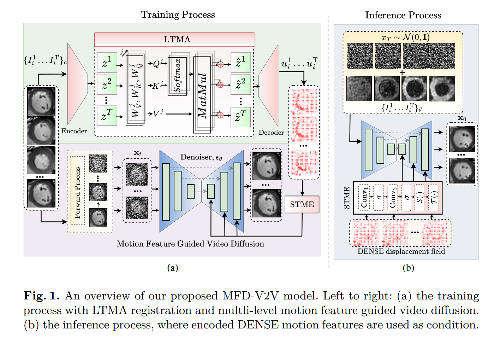

## Demonstration of MFD-V2V
<p align="center">
  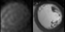
  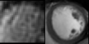
  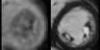
</p>
<p align="center">
  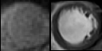
  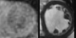
  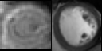
</p>
<p align="center">
  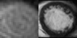
  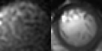
  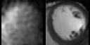
</p>
<p align="center">
  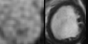
  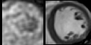
  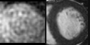
</p>

In the above demos, for each coloum, **(left)** is the DENSE CMR sequences and **(right)** is the paired Cine CMR sequences synthesized by our method MFD-V2V. 

## How to Train MFD-V2V

### Folder Structure
This project expects the input data to be organized in the following directory structure under the root directory:

```
contrast_normalized_ventricles/
├── A01_P00/
│   ├── image_00001.png
│   ├── image_00002.png
│   ├── ...
│   └── image_00020.png
├── A01_P01/
│   ├── image_00001.png
│   ├── image_00002.png
│   ├── ...
│   └── image_00020.png
├── A01_P05/
├── A01_P06/
├── A01_P07/
└── A01_P08/
```

- Each subfolder inside `contrast_normalized_ventricles/` corresponds to a different subject or timepoint (e.g., `A01_P00`, `A01_P01`, etc.).
- Inside each subfolder, images are stored as sequential `.png` files: `image_00001.png`, `image_00002.png`, ..., `image_00020.png`.
- All image slices for a particular scan must be present and follow the exact naming convention to ensure compatibility with the codebase.


### Train the Registration Network
If you want to train the registration network, then go to the "Train LTMA registration Network" and run the Main.py file. The code will automatically save the last checkpoint for you, so you don't need to do anything. After training the registration network put the checkpoint in the models folder. We already provide the pretrain weights of the registration network inside the models folder.

Run this below command if you want to train our registration network

                                        `python Train LTMA registration Network/Main.py`

### Download the Pretrain Diffusion weights
Download the pretrain diffusion model weights from [this box directory](https://virginia.box.com/s/gk59e7ea0ni306xvcx527aa69dzdc1zd). Unzip it and place the *videoflowdiff_natops* folder in this code base. 

### Train the Diffusion Model
Currently, the code is implemented to use **4 GPUs**. Each GPU requires **48GB** of memory at least. If you want to train the diffusion model, then run the below command

                                torchrun --nproc_per_node=4 --nnodes=1 --node_rank=0 --master_addr="127.0.0.1" --master_port=29500 train_video_flow_diffusion.py 

We already provide the pretrain weight of our registration network (LTMA) as a .pth file inside the **models** folder.
